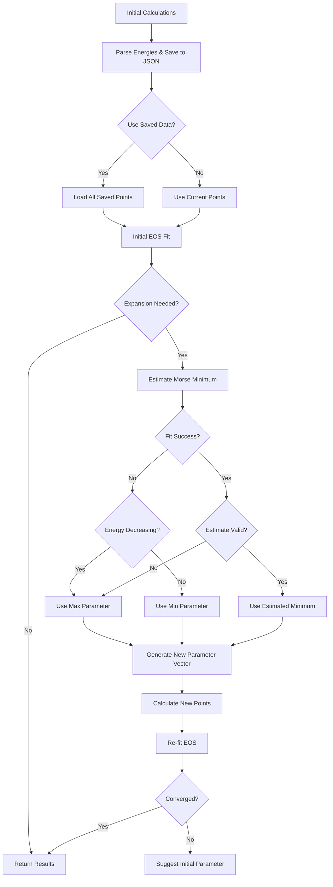

# Automatic Parameter Estimation with Morse EOS

## Overview

Automatically expands parameter ranges when equilibrium falls outside the initial range. Uses Modified Morse EOS fitting to estimate the global minimum and generates new calculation points around the estimate.

## Key Features

- **Modified Morse EOS Estimation**: Fits `E(R) = a + b·exp(-λ·R) + c·exp(-2λ·R)` to estimate global minimum
- **Robust Convergence**: Uses `maxfev=20000` and `method='trf'` for reliable fitting
- **Safety Checks**: Validates estimates and falls back to sensible values (max parameter if energy decreasing)
- **Data Persistence**: Always saves parameter-energy data to JSON files
- **Flexible Data Usage**: Control whether to use all saved data or only current workflow

## When Expansion Occurs

Expansion is triggered if any of these conditions are met:
1. **NaN values**: EOS fit returned NaN for rwseq, eeq, or bmod
2. **Equilibrium outside range**: `equilibrium_value < min(param)` OR `> max(param)`
3. **Energy monotonic**: Energy still decreasing at max OR increasing at min

## Workflow



## Mathematical Foundation

The Modified Morse equation (Moruzzi et al. 1988):

**E(R) = a + b·exp(-λ·R) + c·exp(-2λ·R)**

To find the minimum:
1. Set derivative to zero: `dE/dR = -λ·b·exp(-λ·R) - 2λ·c·exp(-2λ·R) = 0`
2. Solve: `exp(-λ·R_eq) = -b/(2c) = x₀`
3. Extract: `R_eq = -ln(x₀)/λ`

This gives the **global minimum** of the curve, which may be outside the data range.

## Safety Checks

1. **After successful fit**: If energy is decreasing and `R_eq < max(param_values)`, use `max(param_values)` instead
2. **If fit fails**: Use `max(param_values)` if energy decreasing, else `min(param_values)`

## Configuration

```yaml
# Enable automatic range expansion
eos_auto_expand_range: false  # Default: false (opt-in)

# Data usage for EOS fitting
eos_use_saved_data: false  # Default: false
# true: Use ALL points from saved file (accumulated over multiple runs)
# false: Use ONLY current workflow's array (just generated)
# Note: Data is always saved regardless of this flag
```

## Implementation Details

### Core Functions

- **`detect_expansion_needed()`**: Checks if expansion is needed (3 criteria)
- **`estimate_morse_minimum()`**: Fits Modified Morse EOS and calculates equilibrium
- **`generate_parameter_vector_around_estimate()`**: Creates new parameter vector centered around estimate
- **`prepare_data_for_eos_fit()`**: Handles data loading/saving based on user preference

### Data Persistence

- **Always saves** parameter-energy data to `{parameter_name}_energy_data.json`
- No user option to disable saving
- User controls data source for fitting via `eos_use_saved_data` flag

### Expansion Process

1. Detect if expansion needed after initial EOS fit
2. Estimate minimum using Modified Morse EOS fitting
3. Generate new parameter vector (same number of points as initial)
4. Calculate new points (skip if already calculated)
5. Re-fit EOS with symmetric selection (if enabled)
6. If still not converged: Suggest `initial_sws` value to user

## Backward Compatibility

- Feature is **opt-in** via `eos_auto_expand_range: false` (default)
- Data saving adds files but doesn't break existing workflows
- `eos_use_saved_data: false` (default) maintains existing behavior
- No breaking changes to function signatures
