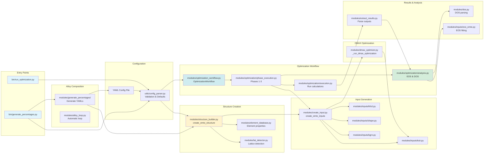
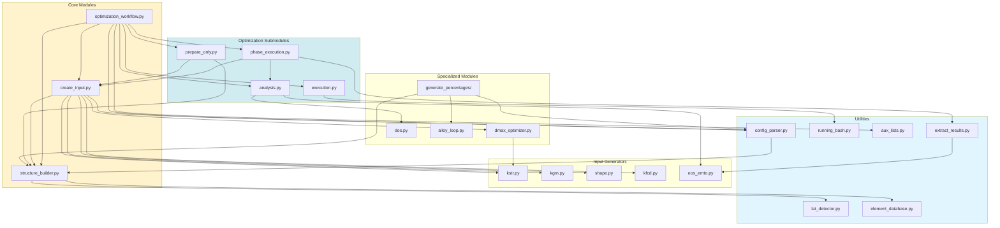

# EMTO Input Automation - Workflow Diagrams

## Complete Workflow Diagram

This diagram shows the complete workflow with all module connections and data flow.

```mermaid
flowchart TD
    Start([User: YAML Config]) --> ConfigParser[utils/config_parser.py<br/>load_and_validate_config]
    
    ConfigParser --> Validate{Validate Config}
    Validate -->|Invalid| Error([Error: Invalid Config])
    Validate -->|Valid| ApplyDefaults[Apply Defaults]
    
    ApplyDefaults --> EntryPoint{Entry Point?}
    
    EntryPoint -->|run_optimization.py| OptWorkflow[modules/optimization_workflow.py<br/>OptimizationWorkflow]
    EntryPoint -->|generate_percentages.py| GenPercentages[modules/generate_percentages/<br/>generate_percentage_configs]
    
    %% Generate Percentages Path
    GenPercentages --> GenStructure[modules/structure_builder.py<br/>create_emto_structure]
    GenStructure --> GenCompositions[modules/generate_percentages/composition.py<br/>generate_compositions]
    GenCompositions --> GenYAML[modules/generate_percentages/yaml_writer.py<br/>write_yaml_file]
    GenYAML --> YAMLFiles([Generated YAML Files<br/>Fe50_Pt50.yaml, etc.])
    YAMLFiles -->|User runs individually| OptWorkflow
    
    %% Optimization Workflow Path
    OptWorkflow --> CheckPrepare{prepare_only?}
    CheckPrepare -->|Yes| PrepareOnly[modules/optimization/prepare_only.py<br/>run_prepare_only_mode]
    CheckPrepare -->|No| FullWorkflow[Full Optimization Workflow]
    
    PrepareOnly --> CreateInputsOnly[modules/create_input.py<br/>create_emto_inputs]
    CreateInputsOnly --> InputFiles([Input Files Only<br/>No Execution])
    
    FullWorkflow --> Step1[Step 1: Structure Creation]
    Step1 --> StructureBuilder[modules/structure_builder.py<br/>create_emto_structure]
    
    StructureBuilder --> CheckInput{Input Type?}
    CheckInput -->|CIF File| ParseCIF[utils/parse_cif.py<br/>Load CIF]
    CheckInput -->|Parameters| BuildFromParams[Build from lat, a, sites]
    
    ParseCIF --> ApplySubs{Substitutions?}
    ApplySubs -->|Yes| ApplySubstitutions[Apply element substitutions]
    ApplySubs -->|No| LatDetector
    
    BuildFromParams --> LatDetector[modules/lat_detector.py<br/>Lattice detection &<br/>Primitive vectors]
    ApplySubstitutions --> LatDetector
    
    LatDetector --> ElementDB[modules/element_database.py<br/>Get element properties]
    ElementDB --> StructureDict([Structure Dictionary<br/>lat, NQ3, atom_info, etc.])
    
    StructureDict --> Step2[Step 2: Prepare Ranges]
    Step2 --> PrepareRanges[utils/aux_lists.py<br/>prepare_ranges]
    PrepareRanges --> Ranges([ca_ratios, sws_values])
    
    Ranges --> CheckOptCA{optimize_ca?}
    CheckOptCA -->|Yes| Phase1[Phase 1: c/a Optimization]
    CheckOptCA -->|No| UseCA[Use provided c/a]
    
    Phase1 --> Phase1Create[modules/optimization/phase_execution.py<br/>optimize_ca_ratio]
    Phase1Create --> Phase1Inputs[modules/create_input.py<br/>create_emto_inputs]
    
    Phase1Inputs --> CheckDMAX{DMAX Optimization?}
    CheckDMAX -->|Yes| DMAXOpt[modules/dmax_optimizer.py<br/>_run_dmax_optimization]
    CheckDMAX -->|No| DirectInputs
    
    DMAXOpt --> DMAXKSTR[Create KSTR inputs<br/>with dmax_initial]
    DMAXKSTR --> RunKSTR[Run KSTR executable<br/>Early termination]
    RunKSTR --> ParsePRN[Parse .prn files<br/>Extract shells]
    ParsePRN --> FindDMAX[Find optimal DMAX<br/>per c/a ratio]
    FindDMAX --> DirectInputs
    
    DirectInputs --> GenerateInputs[modules/inputs/<br/>Generate all input files]
    GenerateInputs --> KSTR[modules/inputs/kstr.py<br/>create_kstr_input]
    GenerateInputs --> SHAPE[modules/inputs/shape.py<br/>create_shape_input]
    GenerateInputs --> KGRN[modules/inputs/kgrn.py<br/>create_kgrn_input]
    GenerateInputs --> KFCD[modules/inputs/kfcd.py<br/>create_kfcd_input]
    
    KSTR --> InputFiles1([KSTR .dat files])
    SHAPE --> InputFiles2([SHAPE .dat files])
    KGRN --> InputFiles3([KGRN .dat files])
    KFCD --> InputFiles4([KFCD .dat files])
    
    InputFiles1 --> RunPhase1{Run Calculations?}
    InputFiles2 --> RunPhase1
    InputFiles3 --> RunPhase1
    InputFiles4 --> RunPhase1
    
    RunPhase1 -->|Yes| ExecPhase1[modules/optimization/execution.py<br/>run_calculations]
    RunPhase1 -->|No| ParsePhase1
    
    ExecPhase1 --> CheckMode{Run Mode?}
    CheckMode -->|sbatch| SLURM[utils/running_bash.py<br/>run_sbatch]
    CheckMode -->|local| Local[utils/running_bash.py<br/>chmod_and_run]
    
    SLURM --> WaitJobs[Wait for completion]
    Local --> WaitJobs
    WaitJobs --> ParsePhase1
    
    ParsePhase1 --> ParseKFCD1[modules/extract_results.py<br/>parse_kfcd]
    ParseKFCD1 --> Energies1([Energy vs c/a data])
    
    Energies1 --> EOSFit1[modules/optimization/analysis.py<br/>run_eos_fit]
    EOSFit1 --> CreateEOS1[modules/inputs/eos_emto.py<br/>create_eos_input]
    CreateEOS1 --> RunEOS1[Run EOS executable]
    RunEOS1 --> ParseEOS1[modules/inputs/eos_emto.py<br/>parse_eos_output]
    ParseEOS1 --> OptimalCA([Optimal c/a ratio])
    
    OptimalCA --> CheckOptSWS{optimize_sws?}
    UseCA --> CheckOptSWS
    
    CheckOptSWS -->|Yes| Phase2[Phase 2: SWS Optimization]
    CheckOptSWS -->|No| UseSWS[Use provided SWS]
    
    Phase2 --> Phase2Create[modules/optimization/phase_execution.py<br/>optimize_sws]
    Phase2Create --> Phase2Inputs[modules/create_input.py<br/>create_emto_inputs<br/>at optimal c/a]
    Phase2Inputs --> GenerateInputs2[Generate inputs<br/>for SWS sweep]
    GenerateInputs2 --> RunPhase2[Run calculations]
    RunPhase2 --> ParseKFCD2[Parse KFCD outputs]
    ParseKFCD2 --> Energies2([Energy vs SWS data])
    Energies2 --> EOSFit2[Run EOS fit]
    EOSFit2 --> OptimalSWS([Optimal SWS])
    
    OptimalSWS --> Phase3[Phase 3: Optimized Calculation]
    UseSWS --> Phase3
    
    Phase3 --> Phase3Create[modules/optimization/phase_execution.py<br/>run_optimized_calculation]
    Phase3Create --> Phase3Inputs[Create inputs<br/>with optimal params]
    Phase3Inputs --> RunPhase3[Run full calculation]
    RunPhase3 --> ParseResults[modules/extract_results.py<br/>parse_kfcd, parse_kgrn]
    
    ParseResults --> CheckDOS{generate_dos?}
    CheckDOS -->|Yes| DOSAnalysis[modules/optimization/analysis.py<br/>generate_dos_analysis]
    CheckDOS -->|No| Summary
    
    DOSAnalysis --> DOSParser[modules/dos.py<br/>DOSParser]
    DOSParser --> DOSPlotter[modules/dos.py<br/>DOSPlotter]
    DOSPlotter --> DOSPlots([DOS plots])
    
    Summary --> GenerateReport[modules/optimization/analysis.py<br/>generate_summary_report]
    GenerateReport --> Report([workflow_summary.txt<br/>workflow_results.json])
    
    Report --> End([Workflow Complete])
    
    style Start fill:#e1f5ff
    style End fill:#d4edda
    style Error fill:#f8d7da
    style StructureDict fill:#fff3cd
    style OptimalCA fill:#d1ecf1
    style OptimalSWS fill:#d1ecf1
    style Report fill:#d4edda
```

## Summarized Workflow Diagram

High-level overview of the main workflows and module relationships.

## Module Dependency Graph

Shows how modules depend on each other.

## Data Flow Diagram

Shows how data flows through the system.

```mermaid
flowchart LR
    subgraph Input["User Input"]
        YAML[YAML Config]
        CIF[CIF File<br/>Optional]
        Params[Lattice Parameters<br/>Optional]
    end
    
    subgraph Processing["Processing"]
        Config[Config Parser<br/>Validates & Defaults]
        Structure[Structure Builder<br/>Creates Structure Dict]
        Ranges[Range Preparation<br/>ca_ratios, sws_values]
    end
    
    subgraph Generation["File Generation"]
        InputGen[Input Generator<br/>KSTR, SHAPE, KGRN, KFCD]
        DMAX[DMAX Optimizer<br/>Optional]
    end
    
    subgraph Execution["Execution"]
        Run[Run EMTO<br/>KSTR, SHAPE, KGRN, KFCD]
        Monitor[Monitor Jobs<br/>Wait for completion]
    end
    
    subgraph Analysis["Analysis"]
        Parse[Parse Results<br/>Extract energies]
        EOSFit[EOS Fitting<br/>Find optimal params]
        DOSAnalysis[DOS Analysis<br/>Optional]
    end
    
    subgraph Output["Output"]
        Results[JSON Results]
        Plots[Plots & Reports]
        Summary[Summary Report]
    end
    
    YAML --> Config
    CIF --> Config
    Params --> Config
    
    Config --> Structure
    Structure --> Ranges
    Ranges --> InputGen
    
    InputGen --> DMAX
    DMAX --> InputGen
    InputGen --> Run
    
    Run --> Monitor
    Monitor --> Parse
    
    Parse --> EOSFit
    EOSFit --> Results
    Parse --> DOSAnalysis
    DOSAnalysis --> Plots
    
    Results --> Summary
    Plots --> Summary
    
    style Input fill:#e1f5ff
    style Processing fill:#fff3cd
    style Generation fill:#d1ecf1
    style Execution fill:#f8d7da
    style Analysis fill:#d4edda
    style Output fill:#d4edda
```

## Workflow Phases Diagram

Detailed view of the optimization workflow phases.

```mermaid
flowchart TD
    Start([Start Workflow]) --> LoadConfig[Load & Validate Config]
    LoadConfig --> CreateStructure[Create Structure<br/>CIF or Parameters]
    
    CreateStructure --> PrepareRanges[Prepare Parameter Ranges<br/>ca_ratios, sws_values]
    
    PrepareRanges --> CheckCA{optimize_ca?}
    
    CheckCA -->|Yes| Phase1[Phase 1: c/a Optimization]
    CheckCA -->|No| UseCA[Use provided c/a]
    
    Phase1 --> P1Inputs[Create Inputs<br/>Sweep c/a at fixed SWS]
    P1Inputs --> P1Run[Run Calculations]
    P1Run --> P1Parse[Parse Energies]
    P1Parse --> P1EOS[Fit EOS]
    P1EOS --> OptimalCA([Optimal c/a])
    
    OptimalCA --> CheckSWS{optimize_sws?}
    UseCA --> CheckSWS
    
    CheckSWS -->|Yes| Phase2[Phase 2: SWS Optimization]
    CheckSWS -->|No| UseSWS[Use provided SWS]
    
    Phase2 --> P2Inputs[Create Inputs<br/>Sweep SWS at optimal c/a]
    P2Inputs --> P2Run[Run Calculations]
    P2Run --> P2Parse[Parse Energies]
    P2Parse --> P2EOS[Fit EOS]
    P2EOS --> OptimalSWS([Optimal SWS])
    
    OptimalSWS --> Phase3[Phase 3: Optimized Calculation]
    UseSWS --> Phase3
    
    Phase3 --> P3Inputs[Create Inputs<br/>Optimal c/a & SWS]
    P3Inputs --> P3Run[Run Full Calculation]
    P3Run --> P3Parse[Parse Results]
    
    P3Parse --> CheckDOS{generate_dos?}
    CheckDOS -->|Yes| DOS[Analyze DOS]
    CheckDOS -->|No| Report
    
    DOS --> Report[Generate Summary Report]
    Report --> End([End])
    
    style Start fill:#e1f5ff
    style OptimalCA fill:#d1ecf1
    style OptimalSWS fill:#d1ecf1
    style End fill:#d4edda
    style Phase1 fill:#fff3cd
    style Phase2 fill:#fff3cd
    style Phase3 fill:#fff3cd
```

